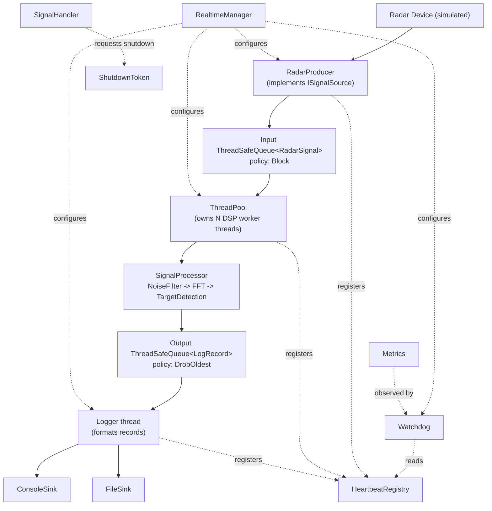
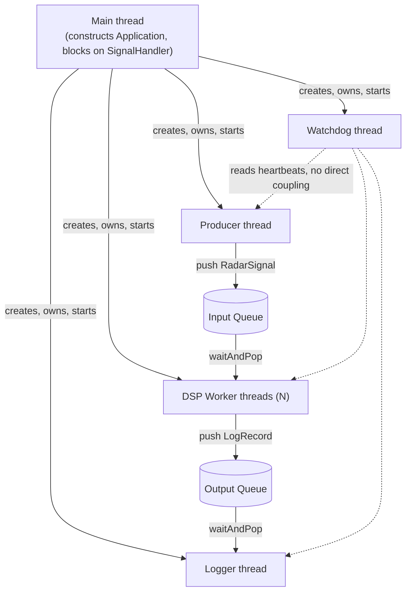
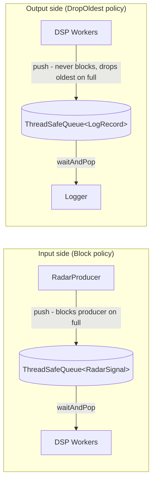
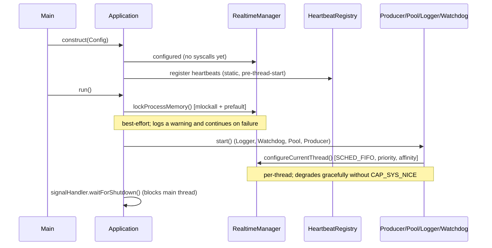
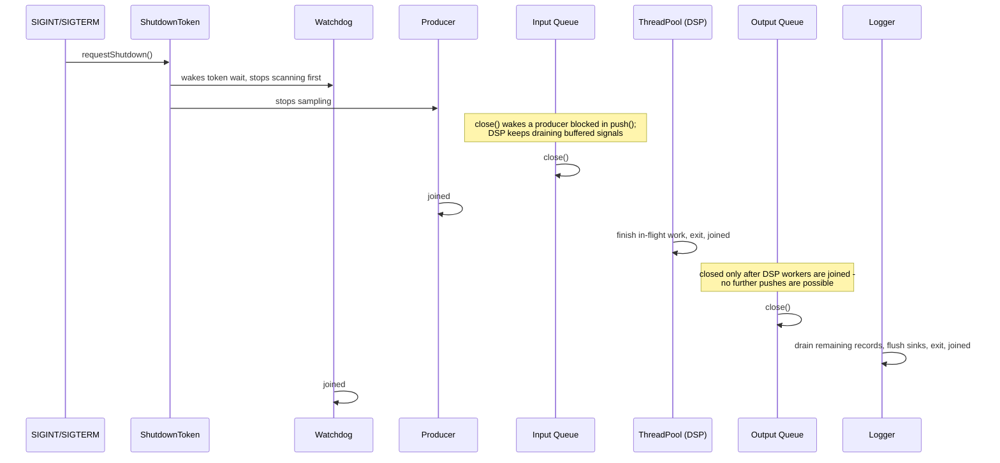

# Diagrams

Rendered (Mermaid) companions to the ASCII diagrams in
[ARCHITECTURE.md](../ARCHITECTURE.md). ARCHITECTURE.md is authoritative on any
conflict; these diagrams are a visual aid, not a second source of decisions.

## Architecture / data-flow diagram

## Thread interaction diagram

Every thread is wrapped in a `ManagedThread` (RAII join on destruction).
Workers never synchronize directly with each other — all communication is
through the two queues, and the Watchdog only *reads* shared heartbeat state.

## Queue flow diagram

The Input Queue applies backpressure (D5): a full queue blocks the producer
rather than losing a sampled signal. The Output / Log Queue is lossy by
design: a slow sink drops the oldest buffered record instead of propagating
backpressure into the `SCHED_FIFO` DSP workers.

## Startup sequence

## Shutdown sequence (ordered drain)

No in-flight signal or pending log record is lost: every consumer is joined
before the queue it feeds is closed (see ARCHITECTURE.md, "Lifetime").

## Realtime and priority-inversion notes

* **Two-stage configuration (D2).** `mlockall(MCL_CURRENT | MCL_FUTURE)` and
  prefaulting run once in `main`/`Application::run()`, before any thread is
  created. `SCHED_FIFO` and per-role priority are applied per-thread, because
  `pthread_setschedparam` needs the target thread to already exist.
* **Priority inversion** is addressed by `PiMutex`
  (`PTHREAD_PRIO_INHERIT`), used as the queue's internal lock. The Producer
  (priority 80 by default), DSP workers (70), Watchdog (60) and Logger (40)
  share the two queues at different priorities, so without priority
  inheritance a lower-priority holder of the queue mutex could block a
  higher-priority waiter indefinitely.
* **Graceful degradation.** Every realtime syscall is validated. Missing
  `CAP_SYS_NICE` / a low `RLIMIT_RTPRIO` causes `configureCurrentThread()` to
  return a failure result that the caller logs as a warning; the thread keeps
  running at the default scheduling policy rather than the process aborting.
* **A practical RLIMIT_MEMLOCK caveat.** `mlockall(MCL_FUTURE)` locks every
  page the process maps *afterwards*, including each subsequently created
  thread's stack. On a host with the common 64 MB default `RLIMIT_MEMLOCK`
  (`ulimit -l`), seven `SCHED_FIFO` threads at the default ~8 MB stack size
  can exceed that limit, and `pthread_create` then fails with `EAGAIN`. This
  is not a logic bug in `RealtimeManager` — `mlockall` itself succeeds; the
  budget is exhausted by the threads started afterwards. See "Execution" in
  [README.md](../README.md) for how to raise the limit or run with realtime
  configuration disabled.
